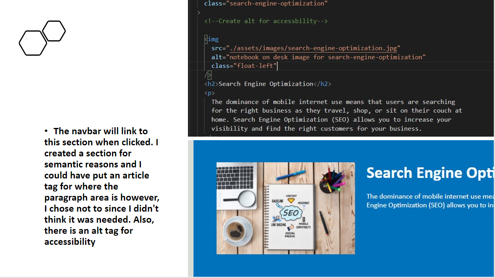
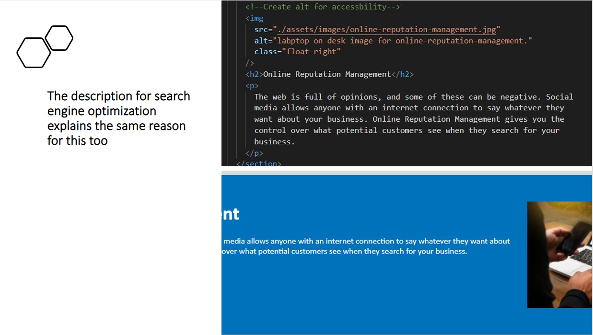
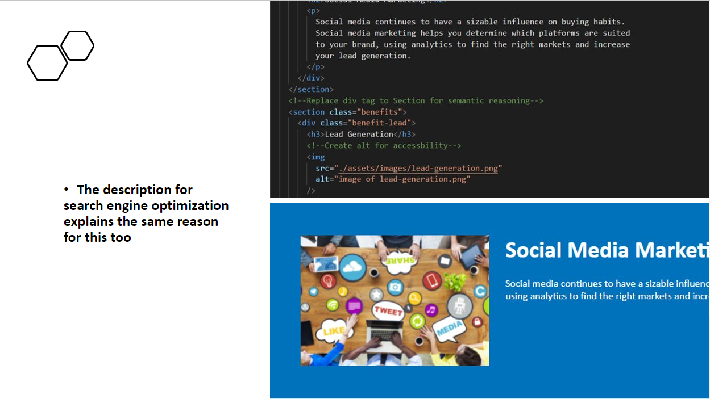
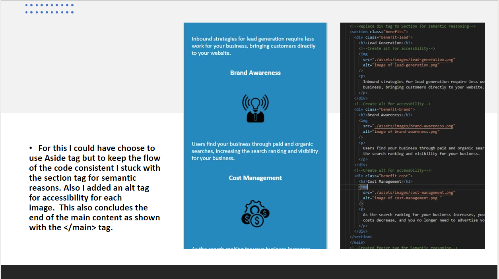
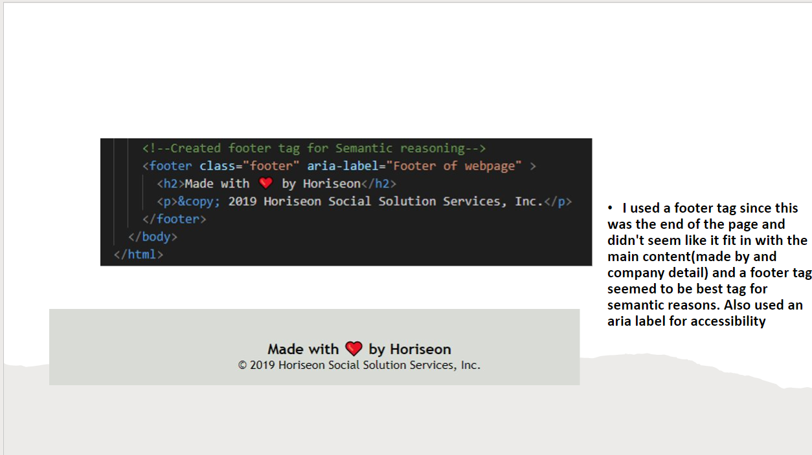
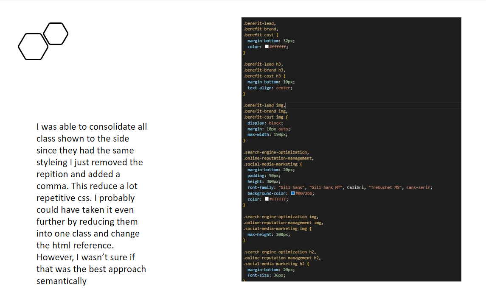
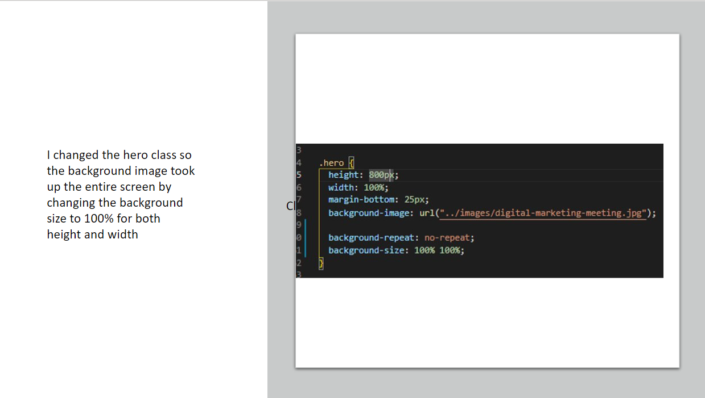

# Refactoring-Horiseon-Webpage


:space_invader:	:space_invader:	:space_invader:	:space_invader:	:space_invader:	 By Siddharth Desai :space_invader:	:space_invader:	:space_invader:	:space_invader:	:space_invader:	

## Description

* What was my motivation: The motivation of doing this assignment was for me to really dig down in the code and find ways to refactor it and make the code more semantically tuned.
* Why did you build this project?: I wanted to get a better understanding on how to consolidate code as well as use proper semantic tags to make the code more readable and intuitive 
* What problem does this solve: This refactored code solved a few problems with how the original code was not easy readable and had much repetitive css code. With my reactored code its much more clear and concise and easier to read.
* What did I learn: I learned a lot how to properly use specific tags throughout an HTML file. For example nav, section, main, footer and header. I also learned a lot on how to reference CSS properly.


## Table of Content
- [Webpage Example](#webpage%20example)
- [Links](#links)
- [Installation](#installation)
- [Usage](#usage)
- [Credits](#credits)
- [Help](#help)
- [License](#license)
- [Links](#links)

<br/>

## Webpage Example


### Installing

* N/A


### Usage

* Below is detail information on the changes made to refactor the webpage
```
Powerpoint Link: https://1drv.ms/p/s!AgwXxffey8u1gmz1j7gzqoeeB9nj?e=gc4ZeR
```
![]assets/images/img-1.PNG)








## Help

Please reach out to me if are you having any issues navigating through the code
```
Contact information: shdesai118@gmail.com
```

## Credits

* https://1drv.ms/p/s!AgwXxffey8u1gmz1j7gzqoeeB9nj?e=gc4ZeR
* https://www.w3schools.com/cssref/css3_pr_background-size.asp
* https://developer.mozilla.org/en-US/docs/Web/HTML/Element
* https://coding-boot-camp.github.io/full-stack/github/professional-readme-guide
* https://gist.github.com/DomPizzie/7a5ff55ffa9081f2de27c315f5018afc#project-title


## License

This project is free use

## Links

[Live Link](https://shd118.github.io/Refactoring-Horiseon-Webpage/)

[Github Link](https://github.com/SHD118/Refactoring-Horiseon-Webpage)


